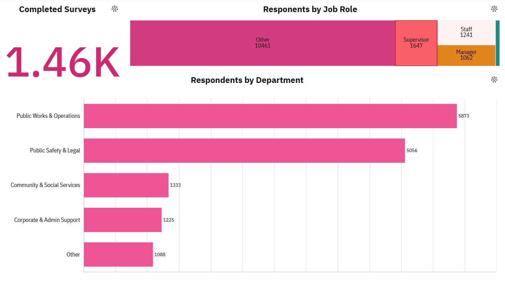
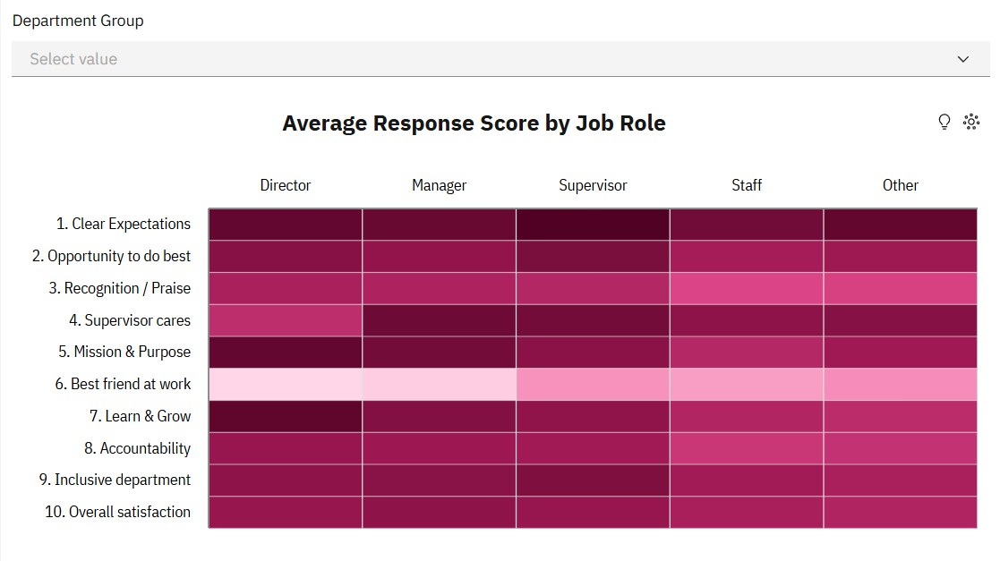
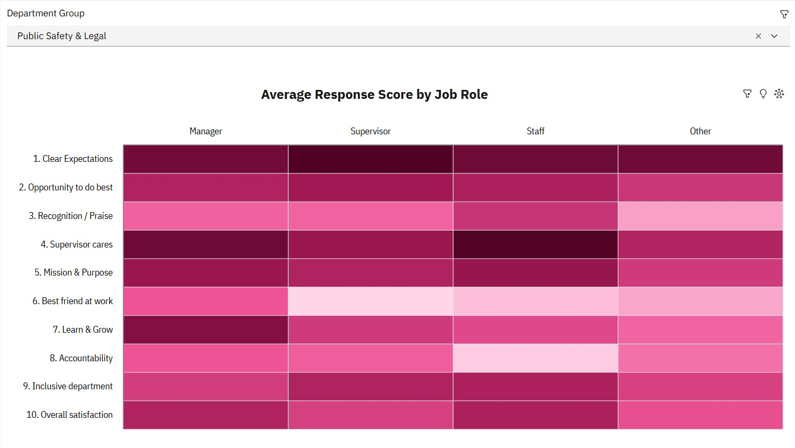
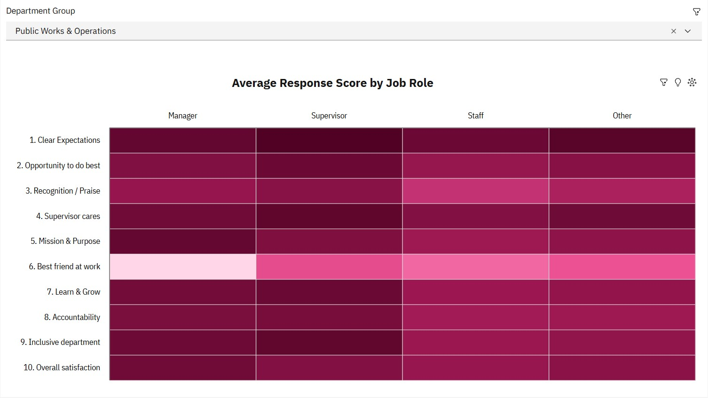
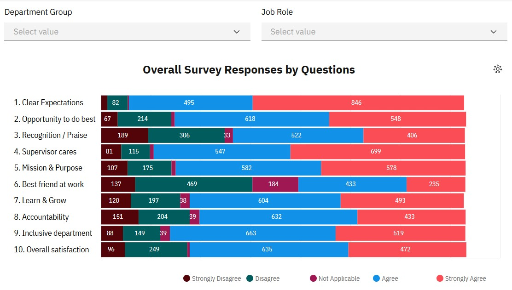
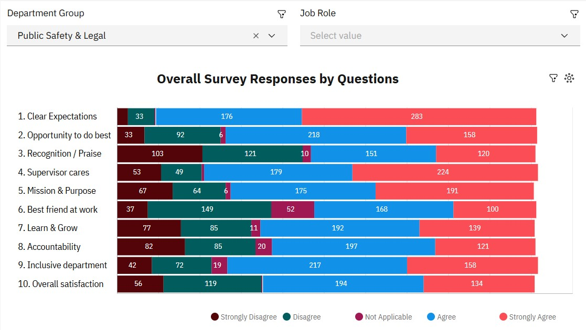
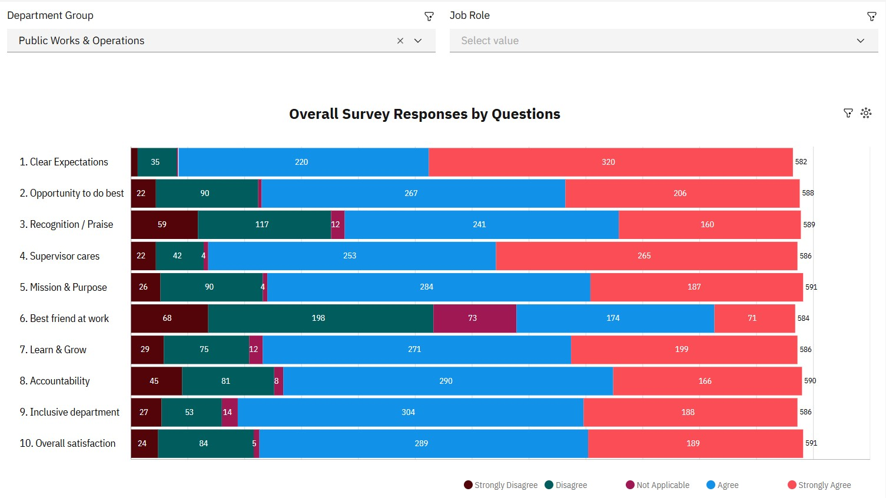

# 📊 Employee Engagement & Perception Gap Analysis

## Objective

In this project, I designed and implemented an end-to-end Business Intelligence solution in IBM Cognos Analytics to evaluate employee engagement survey responses across Pierce County, WA.

* Data Extraction & Filtering: Extracted raw employee survey data using Cognos Data Modules and filtered the dataset to include only completed survey responses.

* Data Transformation & Cleansing: Transformed text-based Likert responses into numeric values (1.0 - 4.0 scale), standardizing survey question labels (e.g., resolving duplicate variations of Question 7) and creating shorthand metric labels for cleaner visualization.

* Dimensional Modeling & Aggregation: Modeled categorical dimensions using Custom SQL / Data Modules by mapping individual Job Role flags into a unified hierarchy and consolidating 20+ granular operational departments into 4 broad functional groups.

* Dashboard & Visualization: Developed an interactive executive dashboard featuring cross-departmental slicers, role divergence tracking, and key sentiment drivers to analyze engagement patterns across the organization.

As a Business Intelligence and Data Modeling project, the primary focus is on analytics architecture, SQL data transformation logic, and executive-level reporting.

The sections below outline the dataset details, technical methodologies, and key business insights.

---

## Table of Content

- [Dataset Used](#dataset-used)
- [Technologies Used](#technologies-used)
- [Step 1: Data Cleaning & Transformation](#step-1-data-cleaning--transformation)
- [Step 2: Data Modeling & Metric Definitions](#step-2-data-modeling--metric-definitions)
- [Step 3: Exploratory Data Analysis](#step-3-exploratory-data-analysis)
- [Step 4: Interactive Dashboard & Visualizations](#step-4-interactive-dashboard--visualizations)
- [Key Findings & Actionable Recommendations](#key-findings--actionable-recommendations)

---

## Dataset Used

* **Source:** Pierce County, WA (Public Domain)
* **Domain:** HR Analytics & Employee Sentiment
* **Structure:** Entity-Attribute-Value (EAV) Survey Data Model
* **Volume(Raw):** 499 records x 25 fields
* **Volume(Transformed): 1,459 processed response values

---

## Technologies Used

* **BI Platform:** IBM Cognos Analytics
* **Data Transformation:** IBM Cognos Data Modules (Custom Calculations, Type Casting, Aggregations)
* **Querying:** Custom SQL Expression Logic (`CASE` / `CAST`)

---

## Step 1: Data Cleaning & Transformation

To prepare the raw survey dataset for analytics, I executed a series of ETL transformations in IBM Cognos Analytics using Custom SQL within the Data Modules.

* Record Filtering & Status Validation:<br>
Filtered the dataset to include only responses with a completed status (Survey Status = 'Completed'). This eliminated incomplete submissions and noise, ensuring data integrity across all downstream visualizations.

* Role Categorization (Job_Role Creation):<br>
The raw data flagged individual roles as separate binary indicator columns (1 or 0). I consolidated these flags into a single, structured categorical dimension using a CASE statement:
```sql
CASE 
    WHEN Director = 1 THEN 'Director'
    WHEN Manager = 1 THEN 'Manager'
    WHEN Supervisor = 1 THEN 'Supervisor'
    WHEN Staff = 1 THEN 'Staff'
    ELSE 'Other'
END AS Job_Role;
```
* Text Standardization & Bug Fixes (Question 7 Duplication):<br>
The raw source dataset contained inconsistent string variations for Question 7 (one using & and another using and), resulting in split metrics for a single question. I normalized this string directly in SQL:
```sql
CASE 
    WHEN Question = '7. This last year, I have had opportunities at work to learn & grow' 
    THEN '7. This last year, I have had opportunities at work to learn and grow'
    ELSE Question 
END AS Clean_Question
```
* Department Grouping & Aggregation:<br>
To reduce granular noise from 20+ individual operational units and enable high-level organizational analysis, I aggregated departments into four primary functional groups:
```sql
CASE 
    WHEN Department IN ('Sheriff''s Department', 'Prosecuting Attorney''s Office', 'District Court', 'Juvenile Court', 'Clerk of Superior Court', 'Superior Court', 'Assigned Council', 'Family Justice Center') 
        THEN 'Public Safety & Legal'
    WHEN Department IN ('Planning and Public Works', 'Parks and Recreation', 'Facilities Management', 'Emergency Management') 
        THEN 'Public Works & Operations'
    WHEN Department IN ('Human Services', 'Economic Development', 'Medical Examiner', 'Communications Office') 
        THEN 'Community & Social Services'
    WHEN Department IN ('Finance and Performance ...', 'Human Resources', 'Assessor-Treasurer''s Office', 'Exec Office & Directors', 'Council''s Office') 
        THEN 'Corporate & Admin Support'
    ELSE 'Other'
END AS Department_Group
```
* Creating Shorthand Variables (Question_Short):<br>
Full survey questions were too verbose for dashboard visuals and charts. I created a shortened categorical variable for cleaner presentation:
```sql
CASE 
    WHEN C_Question LIKE '1.%' THEN '1. Clear Expectations'
    WHEN C_Question LIKE '2.%' THEN '2. Opportunity to do best'
    WHEN C_Question LIKE '3.%' THEN '3. Recognition / Praise'
    WHEN C_Question LIKE '4.%' THEN '4. Supervisor cares'
    WHEN C_Question LIKE '5.%' THEN '5. Mission & Purpose'
    WHEN C_Question LIKE '6.%' THEN '6. Best friend at work'
    WHEN C_Question LIKE '7.%' THEN '7. Learn & Grow'
    WHEN C_Question LIKE '8.%' THEN '8. Accountability'
    WHEN C_Question LIKE '9.%' THEN '9. Inclusive department'
    WHEN C_Question LIKE '10.%' THEN '10. Overall satisfaction'
    ELSE C_Question 
END AS Question_Short
```
* Type Casting & Data Module Attributes:<br>
Explicitly cast string-based numerical responses into float data types (1.0 to 4.0), setting proper Cognos usage properties to Measure (aggregated as Average) for numerical metrics and Identifier/Attribute for categorical dimensions.
---

## Step 2: Data Modeling & Metric Definitions

To enable seamless aggregation and dynamic calculations across the Cognos dashboard (such as the Sentiment Driver Heatmap), I structured the relational data model and defined proper usage properties for both measures and dimensions.

* Measure Configuration & Aggregation Rules:<br>
Set the Response field usage property strictly to Measure and assigned its default aggregation rule to Average. This allowed automated, accurate calculated metrics (e.g., Average Response Score on a 1.0–4.0 Likert scale) without writing redundant manual formulas across different dashboard visual layers.

* Heatmap Data Model Integration:<br>
Configured the matrix structure for the Average Response Score by Job Role heatmap:<br>
Rows (Y-Axis): Question_Short (Dimensions)<br>
Columns (X-Axis): Job_Role (Director, Manager, Supervisor, Staff, Other)<br>
Color Intensity / Values: Response (Aggregated as Average)<br>

* Divergence & Grouping Logic:<br>
By mapping Response as an aggregated average against the newly created Job_Role dimension, the heatmap clearly highlights perception gaps and sentiment divergence—showing exactly how leadership scores differ from frontline Staff on identical survey questions.
---

## Step 3: Exploratory Data Analysis

Highest & Lowest Agreement Questions:<br>

* Most Agreed: Question 1 (Clear Expectations) received the highest agreement overall, with 846 respondents answering "Strongly Agree" and 495 answering "Agree" (totalling 1,341 positive responses out of 1,453). Employees clearly understand their basic roles and requirements.

* Most Disagreed: Question 3 (Recognition / Praise) recorded the highest level of disagreement, with 189 respondents selecting "Strongly Disagree" and 306 selecting "Disagree" (495 total negative responses out of 1,456).

Key Trends & Patterns Across Roles and Departments:<br>

* Hierarchical Perception Gap: A clear trend visible in the heatmap shows that satisfaction drops as you move down the organizational hierarchy. Directors and Managers consistently give higher scores across most categories (especially Learn & Grow and Supervisor Cares) compared to frontline Staff, who show lighter heat values (lower average scores).

* Social Connection Outlier: Question 6 (Best friend at work) shows uniquely low scores across management roles (Directors and Managers), indicating that leadership feels more socially isolated compared to frontline employees.

* Departmental Lag: As noted in the departmental breakdown, the Public Safety & Legal group systematically trails all other divisions across alignment and satisfaction metrics.
---

## Step 4: Interactive Dashboard & Visualizations

To make the survey data actionable for executive leadership, I designed an interactive dashboard in IBM Cognos Analytics focused on high-level engagement trends and deep-dive filtering.

### Chart 1: Demographics & Response Distribution Dashboard

To establish a clear baseline of respondent demographics and data coverage, I created a functional dashboard filtered specifically for completed surveys. This dashboard provides leadership with a transparent overview of sample sizes, job role representation, and departmental breakdowns across the organization.



Key Demographic & Distribution Insights:<br>

* Survey Completion & Data Scope:<br>
The analysis focuses strictly on fully completed survey responses to ensure high data integrity and accuracy when evaluating engagement drivers.

* Dominant Job Roles & Representation:
Most Represented: Frontline Staff made up the largest share of survey respondents, providing a strong operational baseline for company-wide sentiment.<br>

Least Represented: Executive leadership roles (Directors and Managers) accounted for a smaller proportion of overall responses, reflecting standard organizational pyramid structures.<br>

Departmental Breakdown:<br>
Responses were aggregated into five core operational clusters to analyze cross-departmental sentiment:

Public Works & Operations: Represented a significant portion of frontline operational feedback.

Public Safety & Legal: Identified as a key focus area due to noticeable divergence in alignment and satisfaction scores.

Community & Social Services: Provided insights into customer- and community-facing workforce sentiment.

Corporate & Administrative Support: Captured internal support and central administration perspectives.

Other: Encompassed specialized or unassigned roles across the organization.

### Chart 2: Heatmap (Average Response Score by Job Role)

* Purpose & Design:<br>
This visualization maps the average response scores across each survey question against primary organizational roles (Director, Manager, Supervisor, Staff, and Other). The color intensity reflects satisfaction levels, where darker shades represent higher agreement scores and lighter shades indicate lower sentiment or potential areas of concern.



Key Analytical Findings:

* Hierarchical Perception Gap:<br>
There is a distinct horizontal gradient across most engagement questions. Leadership roles (Directors and Managers) consistently display darker tones—indicating higher average scores in areas like 7. Learn & Grow, 5. Mission & Purpose, and 9. Inclusive department. In contrast, frontline Staff exhibit lighter shades across the board, revealing lower overall satisfaction and perceived growth opportunities.

* Social Connection Outlier:<br>
Question 6 (Best friend at work) stands out as an organizational anomaly. It displays the lightest shading on the entire matrix, particularly among Directors and Managers. This highlights a noticeable lack of close social connections within executive and management tiers compared to operational roles.

Universal Areas of High & Low Sentiment:

* Strong Baseline: Question 1 (Clear Expectations) remains consistently dark across all job roles, confirming that clear role definitions are a company-wide strength regardless of seniority.

* Shared Pain Point: Question 3 (Recognition / Praise) shows lighter saturation across both frontline staff and management, signaling a widespread need for improved recognition programs across all organizational levels.

Interactive Features:
The top dropdown filter (Department Group) allows stakeholders to isolate specific divisions (e.g., Public Safety & Legal vs. Public Works) to observe how role dynamics shift across different departments.

Comparing the heatmaps between Public Safety & Legal 



and Public Works & Operations highlights several distinct organizational trends.



Departmental Comparative Analysis: Public Safety & Legal vs. Public Works & Operations

* Overall Satisfaction Contrast:

Public Works & Operations: Displays consistently high satisfaction across almost all roles and categories, represented by uniformly dark saturation.

Public Safety & Legal: Shows noticeably lighter shades across the board, confirming it as a primary low-engagement area within the organization.

Accountability & Peer Dynamics Disconnect:

Public Safety & Legal: Displays significant friction regarding peer performance and social connection. Frontline Staff score Question 8 (Accountability) exceptionally low (very light pink shade), and Supervisors post the lowest score for Question 6 (Best friend at work).

Public Works & Operations: Maintains high accountability ratings across all job levels, with relatively steady social connection scores among operational staff.

* Support & Growth Gaps:

Public Safety & Legal: Shows notable dips in Question 3 (Recognition / Praise) across Managers, Supervisors, and "Other" roles, alongside weaker sentiment for Question 7 (Learn & Grow) among frontline Staff.

Public Works & Operations: Management and frontline workers report high satisfaction regarding growth opportunities, supportive leadership (4. Supervisor cares), and overall department inclusiveness.

* Shared Strengths:

Both departments maintain dark shading for Question 1 (Clear Expectations), proving that fundamental role requirements are well understood regardless of division or engagement levels.

### Chart 3: Diverging Stacked Bar Chart (Overall Survey Responses & Departmental Comparison)

* Purpose & Design:
This chart displays the distribution of sentiment across all ten survey questions using a diverging stacked bar format. It allows leadership to immediately evaluate overall engagement drivers and compare responses when filtering by specific divisions.



Public Safety & Legal vs. Public Works & Operations

*Key Analytical Findings:

Organization-Wide Baseline (Unfiltered):

Top Driver: Question 1 (Clear Expectations) yields the highest positive sentiment overall, with 846 "Strongly Agree" and 495 "Agree" responses out of 1,453 total.

Primary Friction Point: Question 3 (Recognition / Praise) registers the highest disagreement, totaling 495 negative responses (189 "Strongly Disagree" + 306 "Disagree" out of 1,456).

Departmental Deep Dive — Public Safety & Legal:



Recognition Crisis: Dissatisfaction with appreciation spikes significantly in this division. Question 3 (Recognition / Praise) accounts for 224 negative responses out of 505 (103 "Strongly Disagree" + 121 "Disagree"), representing nearly 44% of respondents in this group.

Accountability Concerns: Question 8 (Accountability) shows a high concentration of negative sentiment, with 167 out of 505 respondents (82 "Strongly Disagree" + 85 "Disagree") expressing frustration over how performance is managed.

Departmental Deep Dive — Public Works & Operations:



Strong Overall Sentiment: Positive responses ("Agree" + "Strongly Agree") consistently dominate across most questions. Question 4 (Supervisor cares) performs exceptionally well, with 518 positive responses out of 586 (253 "Agree" + 265 "Strongly Agree").

Targeted Pain Point: Disagreement remains low across most categories, though Question 6 (Best friend at work) records the highest proportion of negative sentiment within this department (266 out of 584 combined negative responses).

## Key Findings & Actionable Recommendations


---

