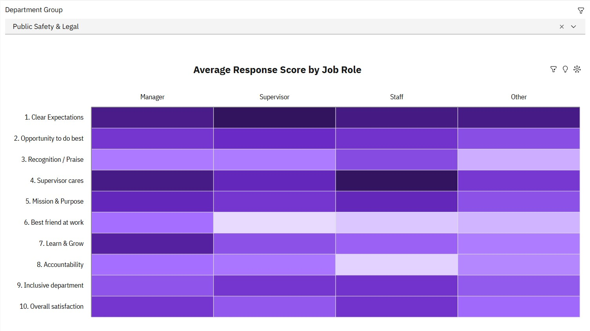
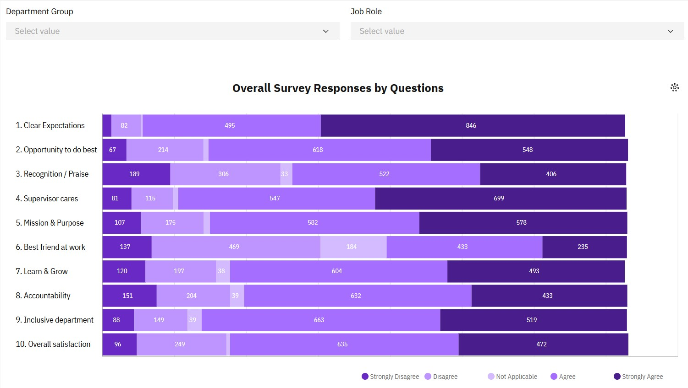
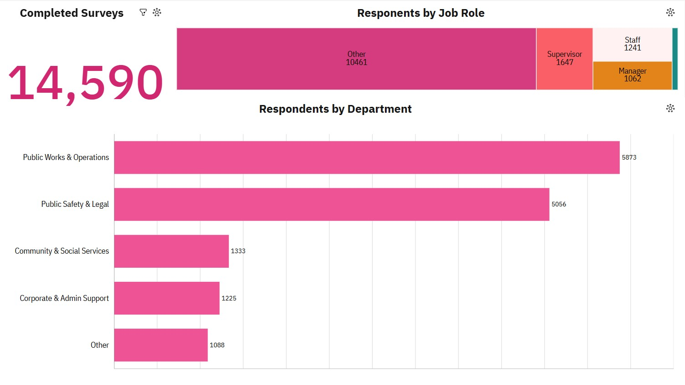

# 📊 Employee Engagement & Perception Gap Analysis

## Objective

In this project, I designed and implemented an end-to-end Business Intelligence solution in IBM Cognos Analytics to evaluate employee engagement survey responses across Pierce County, WA.

* Data Extraction & Filtering: Extracted raw employee survey data using Cognos Data Modules and filtered the dataset to include only completed survey responses.

* Data Transformation & Cleansing: Transformed text-based Likert responses into numeric values (1.0 - 4.0 scale), standardizing survey question labels (e.g., resolving duplicate variations of Question 7) and creating shorthand metric labels for cleaner visualization.

* Dimensional Modeling & Aggregation: Modeled categorical dimensions using Custom SQL / Data Modules by mapping individual Job Role flags into a unified hierarchy and consolidating 20+ granular operational departments into 4 broad functional groups.

* Dashboard & Visualization: Developed an interactive executive dashboard featuring cross-departmental slicers, role divergence tracking, and key sentiment drivers to analyze engagement patterns across the organization.

As a Business Intelligence and Data Modeling project, the primary focus is on analytics architecture, SQL data transformation logic, and executive-level reporting.

The sections below outline the dataset details, technical methodologies, and key business insights.

---

## Table of Content

- [Dataset Used](#dataset-used)
- [Technologies Used](#technologies-used)
- [Step 1: Data Cleaning & Transformation](#step-1-data-cleaning--transformation)
- [Step 2: Data Modeling & Metric Definitions](#step-2-data-modeling--metric-definitions)
- [Step 3: Exploratory Data Analysis](#step-3-exploratory-data-analysis)
- [Step 4: Interactive Dashboard & Visualizations](#step-4-interactive-dashboard--visualizations)
- [Key Findings & Actionable Recommendations](#key-findings--actionable-recommendations)

---

## Dataset Used

* **Source:** Pierce County, WA (Public Domain)
* **Domain:** HR Analytics & Employee Sentiment
* **Structure:** Entity-Attribute-Value (EAV) Survey Data Model
* **Volume(Raw):** 499 records x 25 fields
* **Volume(Transformed): 14,590 processed response values

---

## Technologies Used

* **BI Platform:** IBM Cognos Analytics
* **Data Transformation:** IBM Cognos Data Modules (Custom Calculations, Type Casting, Aggregations)
* **Querying:** Custom SQL Expression Logic (`CASE` / `CAST`)

---

## Step 1: Data Cleaning & Transformation

To prepare the raw survey dataset for analytics, I executed a series of ETL transformations in IBM Cognos Analytics using Custom SQL within the Data Modules.

* Record Filtering & Status Validation:<br>
Filtered the dataset to include only responses with a completed status (Survey Status = 'Completed'). This eliminated incomplete submissions and noise, ensuring data integrity across all downstream visualizations.

* Role Categorization (Job_Role Creation):<br>
The raw data flagged individual roles as separate binary indicator columns (1 or 0). I consolidated these flags into a single, structured categorical dimension using a CASE statement:
```sql
CASE 
    WHEN Director = 1 THEN 'Director'
    WHEN Manager = 1 THEN 'Manager'
    WHEN Supervisor = 1 THEN 'Supervisor'
    WHEN Staff = 1 THEN 'Staff'
    ELSE 'Other'
END AS Job_Role;
```
* Text Standardization & Bug Fixes (Question 7 Duplication):<br>
The raw source dataset contained inconsistent string variations for Question 7 (one using & and another using and), resulting in split metrics for a single question. I normalized this string directly in SQL:
```sql
CASE 
    WHEN Question = '7. This last year, I have had opportunities at work to learn & grow' 
    THEN '7. This last year, I have had opportunities at work to learn and grow'
    ELSE Question 
END AS Clean_Question
```
* Department Grouping & Aggregation:<br>
To reduce granular noise from 20+ individual operational units and enable high-level organizational analysis, I aggregated departments into four primary functional groups:
```sql
CASE 
    WHEN Department IN ('Sheriff''s Department', 'Prosecuting Attorney''s Office', 'District Court', 'Juvenile Court', 'Clerk of Superior Court', 'Superior Court', 'Assigned Council', 'Family Justice Center') 
        THEN 'Public Safety & Legal'
    WHEN Department IN ('Planning and Public Works', 'Parks and Recreation', 'Facilities Management', 'Emergency Management') 
        THEN 'Public Works & Operations'
    WHEN Department IN ('Human Services', 'Economic Development', 'Medical Examiner', 'Communications Office') 
        THEN 'Community & Social Services'
    WHEN Department IN ('Finance and Performance ...', 'Human Resources', 'Assessor-Treasurer''s Office', 'Exec Office & Directors', 'Council''s Office') 
        THEN 'Corporate & Admin Support'
    ELSE 'Other'
END AS Department_Group
```
* Creating Shorthand Variables (Question_Short):<br>
Full survey questions were too verbose for dashboard visuals and charts. I created a shortened categorical variable for cleaner presentation:
```sql
CASE 
    WHEN C_Question LIKE '1.%' THEN '1. Clear Expectations'
    WHEN C_Question LIKE '2.%' THEN '2. Opportunity to do best'
    WHEN C_Question LIKE '3.%' THEN '3. Recognition / Praise'
    WHEN C_Question LIKE '4.%' THEN '4. Supervisor cares'
    WHEN C_Question LIKE '5.%' THEN '5. Mission & Purpose'
    WHEN C_Question LIKE '6.%' THEN '6. Best friend at work'
    WHEN C_Question LIKE '7.%' THEN '7. Learn & Grow'
    WHEN C_Question LIKE '8.%' THEN '8. Accountability'
    WHEN C_Question LIKE '9.%' THEN '9. Inclusive department'
    WHEN C_Question LIKE '10.%' THEN '10. Overall satisfaction'
    ELSE C_Question 
END AS Question_Short
```
* Type Casting & Data Module Attributes:<br>
Explicitly cast string-based numerical responses into float data types (1.0 to 4.0), setting proper Cognos usage properties to Measure (aggregated as Average) for numerical metrics and Identifier/Attribute for categorical dimensions.
---

## Step 2: Data Modeling & Metric Definitions

To enable seamless aggregation and dynamic calculations across the Cognos dashboard (such as the Sentiment Driver Heatmap), I structured the relational data model and defined proper usage properties for both measures and dimensions.

* Measure Configuration & Aggregation Rules:<br>
Set the Response field usage property strictly to Measure and assigned its default aggregation rule to Average. This allowed automated, accurate calculated metrics (e.g., Average Response Score on a 1.0–4.0 Likert scale) without writing redundant manual formulas across different dashboard visual layers.

* Heatmap Data Model Integration:<br>
Configured the matrix structure for the Average Response Score by Job Role heatmap:<br>
Rows (Y-Axis): Question_Short (Dimensions)<br>
Columns (X-Axis): Job_Role (Director, Manager, Supervisor, Staff, Other)<br>
Color Intensity / Values: Response (Aggregated as Average)<br>

* Divergence & Grouping Logic:<br>
By mapping Response as an aggregated average against the newly created Job_Role dimension, the heatmap clearly highlights perception gaps and sentiment divergence—showing exactly how leadership scores differ from frontline Staff on identical survey questions.
---

## Step 3: Exploratory Data Analysis

* Overall Satisfaction & Top/Bottom Drivers:<br>

* High Alignment on Work Expectations:<br>
Standardized metrics show high agreement across all department groups and job roles regarding clear expectations, with averages consistently ranging between 3.2 and 3.8. Respondents universally understand their basic roles and requirements.

* Anomalies in Organization Mission Alignment:<br>
While "The mission or purpose of our organization makes me feel my job is important" scored strongly across most organizational groups (3.0–3.8), the Public Safety & Legal department exhibited a noticeable drop, averaging only 2.9–3.1. This highlights a critical disconnect in organizational alignment within legal and public safety functions.

* Perception Gap Across Department Groups:<br>
The [Heatmap](#heatmap) reveals a distinct Perception Gap between leadership and frontline personnel. Directors and Managers systematically rate growth opportunities (7. This last year, I have had opportunities at work to learn and grow) and inclusive environments (9. My department is inclusive and demonstrates support of a diverse workforce) higher—averaging around 3.4—compared to frontline Staff, who average only 2.6. Once again, the Public Safety & Legal department trails all other operational groups, posting the lowest overall scores (2.6–3.3).
---

## Step 4: Interactive Dashboard & Visualizations

To make the survey data actionable for executive leadership, I designed an interactive dashboard in IBM Cognos Analytics focused on high-level engagement trends and deep-dive filtering.

### Heatmap


* **Key Slicers:** Dynamic filtering by `Department_Group` and completion status.
* **Color Formatting:** Highlights perception gaps between frontline `Staff` and executive leadership (`Directors`/`Managers`).

### 2. Departmental Divergence Analysis



* **Key Insights Visualized:** Directly pinpoints the engagement drop within the **Public Safety & Legal** department across critical questions.
---

## Key Findings & Actionable Recommendations

---

